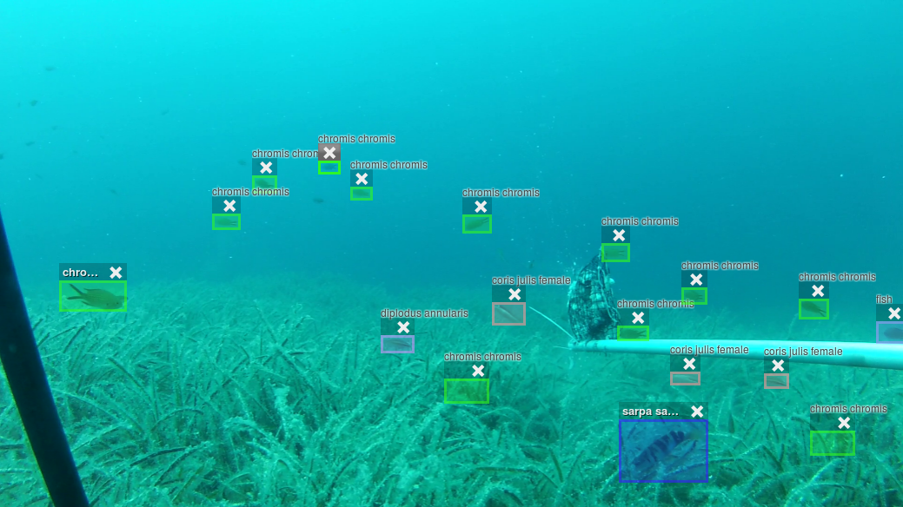

# FishID
Automatic Fish Video Analysis for Ecosystem Observation 

The project "FishIdentification" deals with the automatic counting and identification of fish in high-resolution underwater video recordings. The system to be developed is intended to replace manual and extremely time-consuming video analysis by experts. The aim is to make changes in the ecosystem visible in order to be able to react to negative developments.

## Motivation
The study of fish communities is important to understand the influence of human and natural effects on marine life. Such effects include habitat loss, pollution, overfishing, and climate change. Knowledge of these interrelationships is necessary to develop effective conservation measures for marine fishes, because these fishes are not only an important part of the global marine system, but also a significant (food) resource for humanity.
As an alternative to destructive and extractive methods, underwater video surveys are increasingly used to study marine life. Either remotely operated systems or diver systems are used for this purpose. A major task when using such systems is the analysis of large amounts of video material. For this purpose, the individual fish on each video must be identified, counted and measured. Currently, this evaluation is done manually by experts. This complex procedure is very time-consuming and therefore cost-intensive. Automated methods that allow rapid analysis would result in a larger number of samples in the field trial. This large number of samples increases the statistical power of the analyzed data and researchers are able to detect significant changes in the ecosystem. This can then be used to take measures, such as establishing protected zones, to maintain a healthy marine system.

## Publications

* 2017
  * Visual Fish Tracking: Combining a Two-Stage Graph Approach with CNN-Features
    * [bibtex](bib/jaeger2017.bib), [pdf](https://pub.inf-cv.uni-jena.de/pdf/Jaeger17_VFT)
* 2016
  * SeaCLEF 2016: Object proposal classification for fish detection in underwater videos
    * [bibtex](bib/jaeger2016.bib), [pdf](http://ceur-ws.org/Vol-1609/16090481.pdf)
* 2015
  * Croatian Fish Dataset: Fine-grained classification of fish species in their natural habitat
    * [bibtex](bib/jaeger2015.bib), [pdf](http://www.bmva.org/bmvc/2015/mvab/papers/paper006/paper006.pdf), [web](http://www.bmva.org/bmvc/2015/mvab/papers/paper006/index.html)
    * [Dataset](datasets/croatianFishDataset.zip)

## Participating institutions
* [Fulda University of Applied Sciences](https://www.hs-fulda.de/elektrotechnik-und-informationstechnik/forschung/enview-projekte/fishidentification)
* [University of Zadar](https://www.unizd.hr/cimmar/about-us/introduction)
* [Computer Vision Group Jena](http://www.inf-cv.uni-jena.de/Home.html)

## Related Software Projects
* [Investigation and implementation of modern object detectors for the automatic recognition of fish in videos](https://github.com/mDp0r/FishDet)
* [DAVIT Tracker - Tracking for Fishvideos](https://github.com/gitdudek/davit)